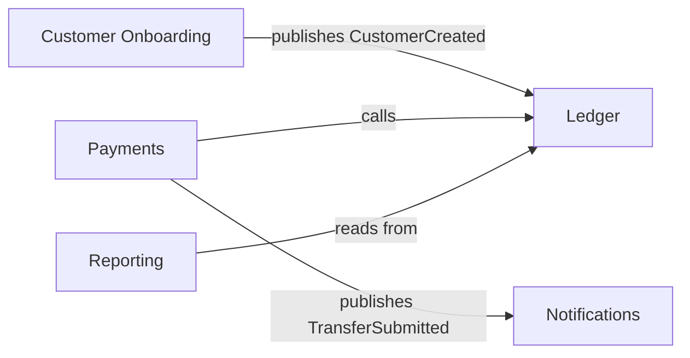

# Domain-Driven Design (DDD)

Make the **business domain** central to the design, with code that speaks the business language. Most valuable for complex domains (finance, healthcare, logistics); overkill for simple CRUD.

## TL;DR (read this first; load deep sections only when needed)

- **Ubiquitous language**: one vocabulary shared by code, conversation, docs. Glossary is `kb/06-glossary.md`. Translation happens at boundaries, not inside the domain.
- **Bounded context**: a boundary within which a term means *one* specific thing. When the same word means different things in different conversations, you've found a context boundary — model them separately.
- **Value object**: immutable, equality by value, invariants enforced in constructor (`Money`, `EmailAddress`). Domain types should be correct-by-construction.
- **Entity**: identity persists across attribute changes. Two entities with the same ID are the same entity.
- **Aggregate**: cluster of entities + values treated as one unit for consistency. Root is the only external entrypoint. One transaction modifies one aggregate.
- **Domain service**: stateless behavior spanning multiple aggregates. Lives in domain layer.
- **Repository**: persistence boundary; interface defined in domain, implementation in adapter. Returns aggregates, not rows.
- **Domain events**: past-tense facts published by an aggregate when its state changes. Immutable. Versioned. Distinguish local (in-process) from integration (cross-context) events.

**When NOT to use DDD**: simple CRUD, throwaway scripts, prototypes still discovering the domain. Pays off when the business logic is non-trivial and the team will live with the code for years.

**Deep sections below** — read only when modeling something specific.

---

## Ubiquitous Language

> One vocabulary, shared by code, conversation, and documentation.

If the business says "wire transfer", the code says `WireTransfer`, not `Tx2` or `PaymentB`. If the code says `apply_settlement`, the team meeting uses the same phrase.

### How to enforce

- **Glossary lives in `kb/06-glossary.md`.** Terms there are the canonical names.
- **Pull request reviewers flag naming drift.** "This is called `tx` everywhere else; rename to `transfer`."
- **Translation at the boundaries only.** External systems may use different names; map at the adapter, don't pollute the domain.

### Smells

- Multiple terms for the same concept (`order`, `cart`, `basket`) used interchangeably.
- One term meaning different things in different parts of the codebase. (This is often a sign of an undiscovered *bounded context* — see below.)
- Domain types named after technical roles (`OrderDto`, `OrderEntity`, `OrderModel`) — the domain term is just `Order`.

---

## Bounded Contexts

> A boundary within which a term means one specific thing.

In a financial product, "Account" means a customer-facing record to the customer service team, a ledger row to the accounting team, and an authentication subject to the security team. **All three are valid.** The mistake is forcing one `Account` class to be all of them.

A bounded context is a slice of the domain with its own internal model, its own language, and a clear boundary at which it translates to/from other contexts.

### How to find them

- **Linguistic shifts.** When the same word means different things in different conversations, you've found a boundary.
- **Team boundaries.** Different teams owning different parts of the model usually align with bounded contexts.
- **Lifecycle boundaries.** Things that change at different rates (a marketing catalog vs. an order fulfillment system) likely belong in different contexts.

### Context map (lightweight)

For any non-trivial system, draw the bounded contexts and how they relate. Mermaid is enough:



The relationships matter: *upstream/downstream*, *conformist/anti-corruption-layer*, *partnership*, *shared kernel*. Pick the right one for each pair and document it in an ADR.

### Anti-Corruption Layer (ACL)

When integrating with a legacy or external system whose model leaks badly, build an ACL — an adapter that translates the foreign model into your context's terms. Domain code never sees the foreign shape.

---

## Building Blocks (inside a bounded context)

### Value Object

An immutable type defined entirely by its attributes. Equality is by value, not identity.

```python
@dataclass(frozen=True, slots=True)
class Money:
    amount_cents: int
    currency: str

    def __post_init__(self):
        if self.amount_cents < 0:
            raise ValueError("Money cannot be negative")
```

`Money(100, "USD") == Money(100, "USD")` is `True`. There is no "this specific instance of $1.00" — it's just $1.00.

Value objects are where invariants live. Validate in the constructor; the type is then *correct by construction*.

### Entity

A type with an identity that persists over time, even as its attributes change.

```python
class Account:
    def __init__(self, id: AccountId, balance: Money, status: AccountStatus): ...
```

Two `Account` instances with `id == AccountId("a_1")` are the *same account*, even if their balances differ in different moments.

### Aggregate

A cluster of entities and value objects treated as one unit for consistency. One entity is the **aggregate root** — the only entrypoint from outside.

Rules:
- All external references go to the root.
- Invariants spanning multiple entities inside the aggregate are enforced by the root.
- One transaction modifies one aggregate. (If you need to modify two, use eventual consistency or rethink the boundary.)
- Aggregates are usually small. If yours has 30 entities, it's probably too big.

```python
class Order:                    # aggregate root
    def __init__(self, id, ...):
        self._items: list[OrderItem] = []   # internal entities; not exposed
        self._total = Money(0, "USD")        # value object

    def add_item(self, sku: str, qty: int, unit_price: Money) -> None:
        # Root enforces invariants spanning items + total
        if self.status != OrderStatus.DRAFT:
            raise OrderClosedError(self.id)
        self._items.append(OrderItem(sku, qty, unit_price))
        self._recompute_total()
```

### Domain Service

When a behavior doesn't belong to a single entity or value object — usually because it spans aggregates — put it in a domain service. Stateless; expressed in domain language.

```python
class TransferService:
    def transfer(self, from_account: Account, to_account: Account, amount: Money) -> Transfer:
        # Coordinates two aggregates. Doesn't belong to either alone.
        ...
```

### Repository

The aggregate's persistence boundary. The domain defines the interface; the adapter implements it.

```python
class OrderRepository(Protocol):
    async def get(self, id: OrderId) -> Order | None: ...
    async def save(self, order: Order) -> None: ...
```

Repositories return aggregates, not rows. They never expose ORM models to the domain.

---

## Domain Events

> Something noteworthy that happened in the domain. Past tense.

Domain events are facts published by an aggregate when its state changes in a meaningful way. They enable loose coupling between contexts.

```python
@dataclass(frozen=True)
class TransferSubmitted:
    transfer_id: TransferId
    from_account: AccountId
    to_account: AccountId
    amount: Money
    submitted_at: datetime
```

### Rules

- **Past tense.** `TransferSubmitted`, not `SubmitTransfer`.
- **Immutable.** A fact doesn't change.
- **Self-contained.** Consumers shouldn't need to look up data the event could have included (within reason).
- **Versioned.** Once a consumer depends on a shape, you can only evolve it additively.
- **Published from the aggregate** that owns the change.

### Local vs. integration events

- **Local domain events** — within one bounded context, dispatched in-process. Good for keeping the aggregate clean (the aggregate emits; another handler reacts).
- **Integration events** — across bounded contexts, dispatched via a broker. The shape becomes a contract. Document it.

These often *look* the same but they aren't — integration events are a public contract, local events are an implementation detail.

---

## When NOT to use DDD

- **Simple CRUD** with no real domain logic. Just write the CRUD.
- **Throwaway scripts or one-off tools.**
- **Prototypes** where you're discovering the domain. Premature aggregates lock in the wrong model.

DDD pays off when:
- The business logic is non-trivial.
- The team will live with the code for years.
- Multiple subsystems share concepts that mean different things in each.

---

## How agents apply DDD in design

1. **Naming review**: cross-reference proposed names against `kb/06-glossary.md`. New domain terms get added to the glossary in the same PR.
2. **Aggregate boundary check**: in design docs, every operation should clearly state which aggregate it modifies. If it modifies two, that's a flag.
3. **Event design**: integration events get the same review rigor as API contracts. Versioning, backward compat, schema registry if you have one.
4. **Bounded context check**: if a PR introduces a new domain concept that already exists elsewhere with a different meaning, that's a strong signal you've found a context boundary. Raise it; consider an ADR.
